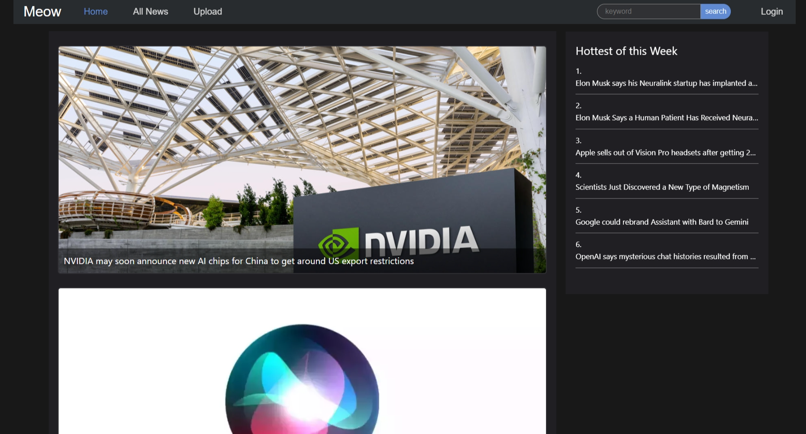
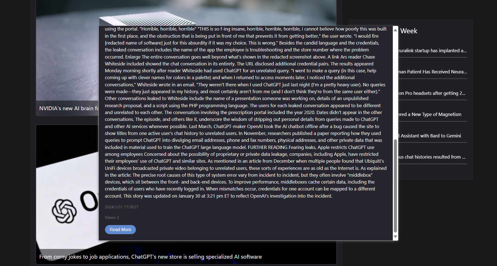

## Project Overview

It's my first Java project, and this project is a news management system developed using `JDK 17`, `Spring Boot 3`, and `ElasticSearch 8`. It provides functionalities for managing news and visitor data. The system also includes a recommendation feature (`Word2Vec` based on `DL4J`) that suggests news based on a user's browsing history.

It's also included a front-end application developed using `vue 3` to demonstrate the system's functionalities.

### TODO:
- Search Functionality: Implement a search feature to allow users to search for news articles by keywords.
- Pagination: Implement pagination for displaying news articles in manageable chunks.
- News Rating: Allow users to rate news articles.
- Advanced Recommendation: Improve the recommendation feature by considering other factors such as user ratings and user preferences.